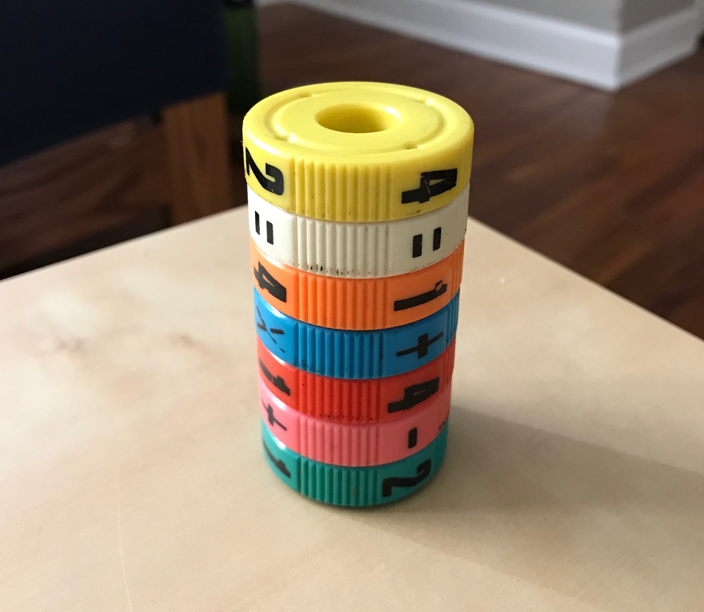

# Math Spin

This is [Math Spin](https://www.geospaceplay.com/collections/games/products/math-spin-box).

The version I own is several magnetic wheels that snap together, with either
four numbers or four symbols on the outside. There might be several games you
can play, but the only game I ever cared about playing was this: how can I
arrange the magnets such that each of the four equations are correct?

## License

See LICENSE for details.
